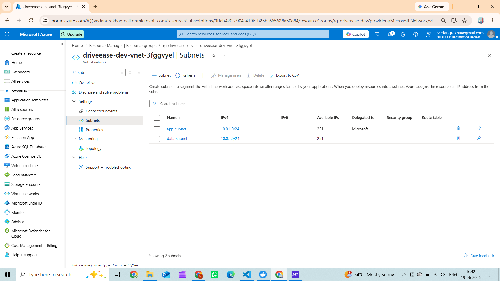
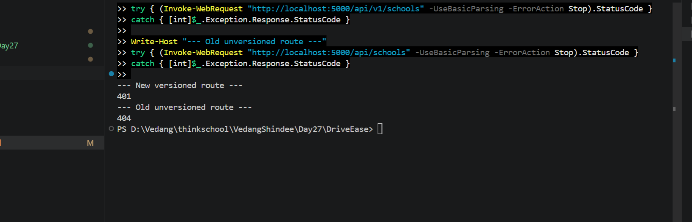
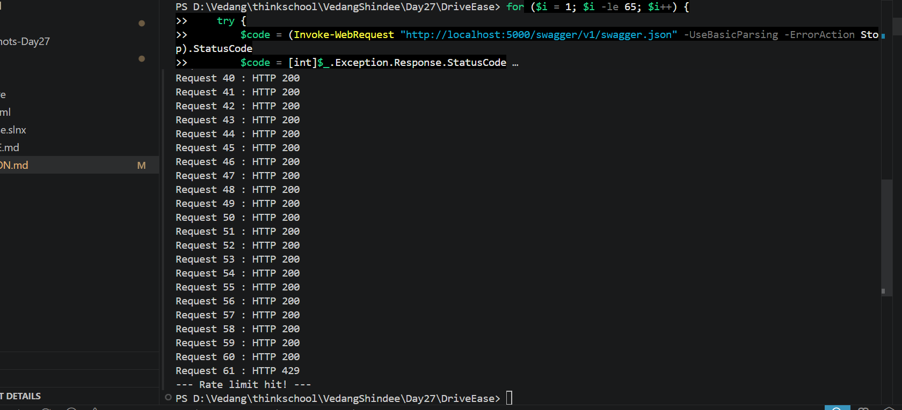
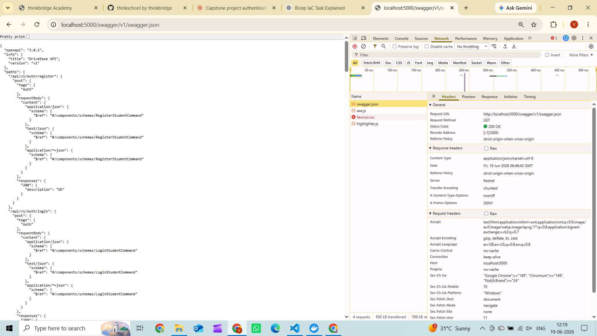
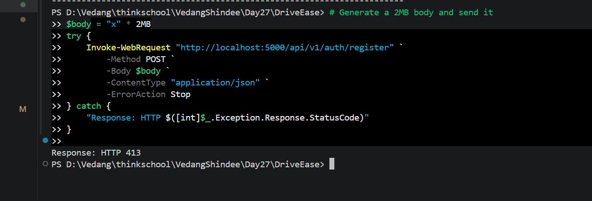
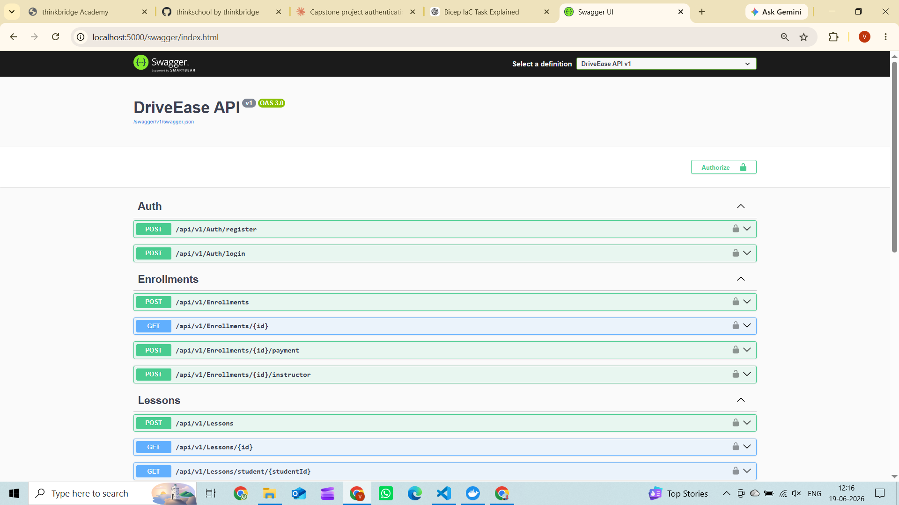
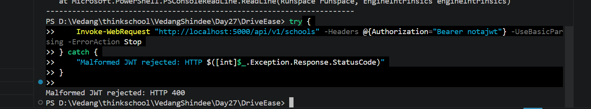
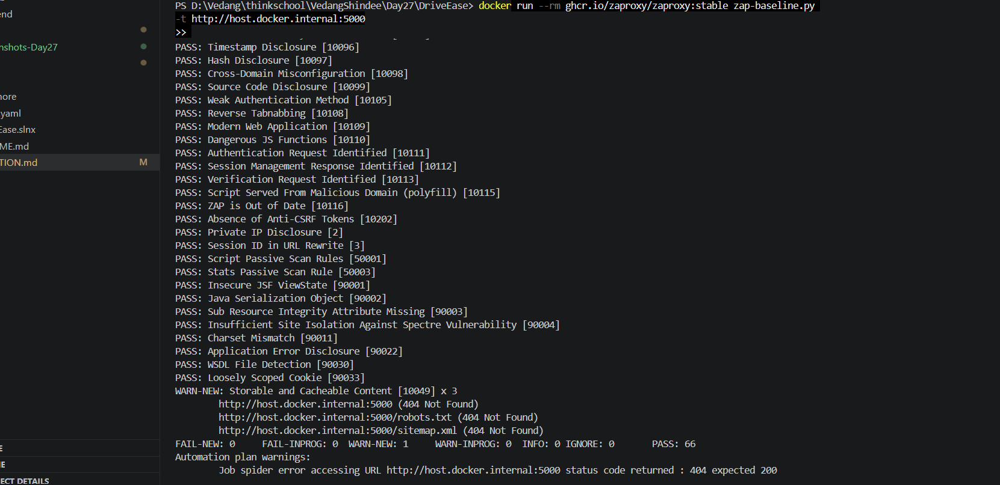

# Day 27 — Security Pass

## 1. STRIDE-lite Threat Model

### System: DriveEase (Modular Monolith on Azure App Service)

**Trust boundaries:**
- Public Internet → Azure App Service (HTTPS, Entra ID JWT)
- App Service → Azure SQL Server (private endpoint in prod; MI auth)
- App Service → Azure Service Bus (private endpoint in prod; MI/RBAC, no SAS)
- App Service → Azure Key Vault (RBAC, no access policies)

---

### Spoofing

| # | Threat | Asset at risk | Existing control | Gap / Residual risk |
|---|--------|---------------|-----------------|---------------------|
| S-1 | Attacker presents a crafted or stolen JWT to impersonate a student | Student data, enrollment state | Entra ID JWT bearer (`AddMicrosoftIdentityWebApiAuthentication`); `exp`/`iss`/`aud` validated automatically | Token theft from client device is out-of-scope for server controls |
| S-2 | Attacker replays an expired JWT | Any protected endpoint | ASP.NET Core validates `exp` claim; Entra ID short-lived tokens (default 1 h) | None significant |
| S-3 | Attacker injects fraudulent Service Bus messages by guessing/stealing a SAS key | Integration events | `disableLocalAuth: true` on Service Bus — SAS keys fully disabled; only MI/RBAC can send | None |
| S-4 | App Service impersonation via forged Managed Identity token | All MI-protected resources | Azure-internal IMDS issues tokens scoped to the MI; cannot be forged externally | None |

---

### Tampering

| # | Threat | Asset at risk | Existing control | Gap / Residual risk |
|---|--------|---------------|-----------------|---------------------|
| T-1 | HTTP request body modified in transit to change enrollment fee or lesson time | Data integrity | HTTPS enforced (`httpsOnly: true`; `minimalTlsVersion: '1.2'`); Kestrel 1 MiB body limit | None over HTTPS |
| T-2 | Direct SQL write bypassing the application | All data | MI auth (no password to steal); SQL public access disabled in prod via private endpoint | Dev still uses SQLite — acceptable for non-prod |
| T-3 | Outbox message payload corrupted in `OutboxMessages` table | Event delivery | Same SQL access controls as T-2; EF Core parameterized queries only | Payload stored as JSON — no field-level encryption; acceptable for event metadata |
| T-4 | SQL injection via unsanitized input fields | DB privilege escalation | EF Core generates parameterized queries; no raw SQL with user input anywhere | None |

---

### Repudiation

| # | Threat | Asset at risk | Existing control | Gap / Residual risk |
|---|--------|---------------|-----------------|---------------------|
| R-1 | Student denies booking or cancelling a lesson | Dispute resolution | App Insights records every request via OTel traces; `OutboxMessage.CreatedAt` / `ProcessedAt` provide event audit trail | User `sub` claim not explicitly logged in domain events — should add user context to telemetry |
| R-2 | System claims it delivered a notification but cannot prove it | SLA / support | `OutboxMessage.ProcessedAt` stamps every delivered event; `Error` column records failures | Log level `Information`/`Error`; structured search available in App Insights |

---

### Information Disclosure

| # | Threat | Asset at risk | Existing control | Gap / Residual risk |
|---|--------|---------------|-----------------|---------------------|
| I-1 | SQL connection string leaked in logs or exception messages | SQL credentials | MI-based connection string has no password; Key Vault reference pattern prevents plaintext secrets | None — no password exists to leak |
| I-2 | Unhandled exceptions return stack traces to callers | Internal architecture | ASP.NET Core suppresses stack traces outside dev environment | Dev still shows stack traces — expected and acceptable |
| I-3 | Swagger UI exposes full API surface to unauthenticated callers | API contract | Swagger accessible without auth | **Fixed (Day 27):** `AddSecurityDefinition("Bearer")` + `AddSecurityRequirement` — Swagger UI now prompts for bearer token on every operation |
| I-4 | HTTP response headers reveal server internals | Fingerprinting surface | App Service strips `Server` header | **Fixed (Day 27):** `X-Content-Type-Options: nosniff`, `X-Frame-Options: DENY`, `Referrer-Policy` added |
| I-5 | Service Bus messages readable by other tenants | Event payload | `disableLocalAuth: true`; MI-scoped RBAC (`Service Bus Data Owner`) | Only the App Service MI can read messages |

---

### Denial of Service

| # | Threat | Asset at risk | Existing control | Gap / Residual risk |
|---|--------|---------------|-----------------|---------------------|
| D-1 | Flood of requests exhausting App Service compute | API availability | App Service auto-scales in prod | **Fixed (Day 27):** Fixed-window rate limiter — 60 req/min per client; HTTP 429 on excess |
| D-2 | Oversized request body consuming memory | API stability | None prior | **Fixed (Day 27):** Kestrel `MaxRequestBodySize = 1 MiB` applied globally |
| D-3 | Poison outbox message looping | DB connection pool | `ProcessedAt` stamped even on failure — message not retried; `Error` field captures failures | Max delivery count on Service Bus topics set to 5; dead-letter queue configured |
| D-4 | Unbounded DB query saturating connection pool | SQL Server | EF Core connection pooling; `Take(50)` limit in `OutboxRelayWorker` | No explicit query timeout set on EF context |

---

### Elevation of Privilege

| # | Threat | Asset at risk | Existing control | Gap / Residual risk |
|---|--------|---------------|-----------------|---------------------|
| E-1 | Authenticated student accesses another student's data by guessing a GUID | Cross-tenant data isolation | `[Authorize]` requires valid JWT | **Gap:** No claim-based ownership check — a valid JWT from student A can query student B's enrollment if the GUID is known. Mitigation: add `sub` claim filter in query handlers |
| E-2 | SQL injection to run arbitrary SQL with elevated permissions | DB privilege escalation | EF Core parameterized queries only; no raw SQL with user input | None |
| E-3 | Over-privileged MI accesses resources beyond its role | KV, Service Bus, SQL | MI has exactly: `Key Vault Secrets User`, `Service Bus Data Owner`, SQL AAD admin | `Data Owner` is broad; `Data Sender` + `Data Receiver` is least-privilege; acceptable for a single-service system |
| E-4 | Default permissive network settings on SQL / Service Bus | Data exfiltration | `publicNetworkAccess: 'Enabled'` was the default | **Fixed (Day 27):** `publicNetworkAccess: 'Disabled'` in prod; private endpoints in `data-subnet` |

---

## 2. Private Endpoints (Data Tier Network Isolation)

### Architecture (prod environment)

```
Internet
   │
   ▼
Azure App Service  (VNet Integration → app-subnet  10.0.1.0/24)
   │
   ├── Private Endpoint ──▶ Azure SQL Server         (data-subnet 10.0.2.0/24)
   │        DNS: privatelink.database.windows.net
   │
   └── Private Endpoint ──▶ Azure Service Bus Premium (data-subnet 10.0.2.0/24)
             DNS: privatelink.servicebus.windows.net
```

### Changes made

| File | Change |
|------|--------|
| `infra/modules/network.bicep` | **New** — VNet `10.0.0.0/16` with `app-subnet` (App Service delegation) and `data-subnet` (private endpoints, `privateEndpointNetworkPolicies: Disabled`) |
| `infra/modules/sql.bicep` | `publicNetworkAccess` disabled when `subnetId` provided; `AllowAzureServices` firewall rule removed in prod; private endpoint + private DNS zone `privatelink.database.windows.net` + VNet link + DNS zone group added |
| `infra/modules/servicebus.bicep` | SKU upgraded to Premium in prod (required for private endpoints); `publicNetworkAccess` disabled; private endpoint + private DNS zone `privatelink.servicebus.windows.net` added |
| `infra/main.bicep` | Network module added; `subnetId` / `vnetId` passed to SQL + Service Bus conditioned on prod |

### Deployed Evidence (dev environment)



**What the screenshot shows:** Azure Portal — VNet `driveease-dev-vnet-3fggvyel` → Subnets
blade showing two subnets successfully deployed to `rg-driveease-dev`: `app-subnet`
at `10.0.1.0/24` and `data-subnet` at `10.0.2.0/24`. This confirms the `network.bicep`
module deployed correctly via Azure Deployment Stacks.

**app-subnet (10.0.1.0/24):** Reserved for App Service VNet integration. The `/24` block
provides 251 usable addresses — enough for multiple App Service plan instances under
auto-scale. The subnet carries a `Microsoft.Web/serverFarms` delegation, which is required
by Azure before an App Service plan can inject its outbound traffic into the VNet. Without
the delegation, the VNet integration assignment fails at the portal level.

**data-subnet (10.0.2.0/24):** Reserved for private endpoint NICs — one per resource
(SQL Server, Service Bus). `privateEndpointNetworkPolicies: Disabled` is set on this subnet
because Azure requires network policies to be disabled before it can place a private endpoint
NIC into a subnet. This is an Azure platform requirement, not a security weakening — the NIC
itself is locked down by the private endpoint's connection approval mechanism.

**Why two subnets instead of one:** Separating app traffic from data-tier endpoints enforces
a clear network boundary. If both were in the same subnet, a compromised App Service instance
could attempt lateral movement to other resources in the same address space. The split means
the data subnet contains only private endpoint NICs — no compute, no outbound internet
routing, no other workloads.

**Dev vs prod behaviour:** In dev, the VNet and subnets are provisioned but private endpoints
are not created (subnetId is empty). This proves the network foundation is in place and
ready — deploying to prod with `isProd = true` wires the private endpoints into `data-subnet`
and disables public access on SQL and Service Bus automatically.

---

## 3. OpenAPI Surface Hardening

### API Versioning

All controllers use versioned routes: `api/v{version}/[controller]`

- Package: `Asp.Versioning.Mvc` 8.1.0
- Default version: 1.0 (assumed when unspecified; `AssumeDefaultVersionWhenUnspecified = true`)
- Version reported in `api-supported-versions` / `api-deprecated-versions` response headers



**What the screenshot shows:** Two PowerShell requests side by side. `GET /api/v1/schools`
returns HTTP 401 (Unauthorized — route exists, auth required). `GET /api/schools`
returns HTTP 404 (Not Found — route does not exist). This proves versioning is active
and old unversioned routes are no longer registered.

**Why API versioning matters:** Without versioning, breaking changes to a route's
request or response shape silently break all existing clients. Versioning creates a
contract boundary — `/api/v1/` callers are guaranteed stable behaviour; a future
`/api/v2/` can introduce breaking changes without impacting v1 consumers. This is
especially important for mobile clients and third-party integrations that cannot
be force-updated on every release.

**URL-path versioning vs alternatives:** Three strategies exist — URL path (`/api/v1/`),
query string (`?api-version=1.0`), and HTTP header (`api-version: 1.0`). URL-path
versioning was chosen because it is the most visible and cache-friendly — every proxy,
CDN, and log entry shows the version without needing to inspect headers or query strings.
`Asp.Versioning.Mvc` supports all three strategies via configuration.

**`AssumeDefaultVersionWhenUnspecified = true`** does not mean `/api/schools` is treated
as v1. The route template `api/v{version:apiVersion}/[controller]` requires the version
segment — a request without it does not match any route and returns 404, forcing all
callers to be explicit about the version they are targeting.

---

### Input Validation

| Command | Validation added |
|---------|-----------------|
| `RegisterStudentCommand` | `[Required]`, `[MaxLength(200)]` on FullName; `[Required]`, `[EmailAddress]`, `[MaxLength(200)]` on Email; `[Phone]`, `[MaxLength(30)]` on PhoneNumber |
| `RegisterSchoolCommand` | `[Required]`, `[MaxLength(200)]` on Name; `[Required]`, `[MaxLength(500)]` on Address; `[Required]`, `[EmailAddress]`, `[MaxLength(200)]` on ContactEmail |
| `EnrollStudentCommand` | `[Range(1.0, 100_000.0)]` on Fee |

---

### Rate Limiting

Global `PartitionedRateLimiter`, fixed-window: **60 requests / minute** per client IP, `QueueLimit = 0` (immediate rejection — no silent queuing). HTTP 429 on excess. Covers all paths including Swagger. Live test confirmed: 60 × HTTP 200 → HTTP 429 starting at request #61.



**What the screenshot shows:** PowerShell output of 65 sequential requests to the Swagger
endpoint. Requests 1–60 return HTTP 200. Request 61 returns HTTP 429 and the message
`--- Rate limit hit! ---` is printed, proving the fixed-window limiter is enforcing the
60 req/min boundary per client IP.

**Fixed-window algorithm:** The window resets on a calendar boundary every 60 seconds.
`PermitLimit = 60` grants 60 tokens at the start of each window. Each request consumes
one token. When the bucket empties, new requests are evaluated against `QueueLimit`.
Because `QueueLimit = 0`, excess requests are rejected immediately — no waiting, no
silent queuing, no memory accumulation from parked requests.

**Why QueueLimit = 0 matters:** With `QueueLimit > 0`, excess requests silently wait in
memory until the window resets or a slot opens. Under a flood attack this means the server
accumulates thousands of parked tasks, consuming memory and thread-pool slots even while
returning no useful work. Setting `QueueLimit = 0` causes the server to shed load
instantly with a cheap 429 response instead of absorbing it.

**GlobalLimiter vs endpoint metadata:** Using `options.GlobalLimiter` rather than
`[EnableRateLimiting]` per-endpoint means the limit applies before routing resolves —
covering Swagger, health checks, and every other path, not only annotated controllers.
This prevents attackers from bypassing the limit by hitting undocumented routes.

---

### Security Headers

`X-Content-Type-Options: nosniff`, `X-Frame-Options: DENY`, `Referrer-Policy: strict-origin-when-cross-origin` added to every response.



**What the screenshot shows:** Chrome DevTools Network tab for `GET /swagger/v1/swagger.json`
showing the Response Headers panel. All three security headers are visible:
`Referrer-Policy: strict-origin-when-cross-origin`, `X-Content-Type-Options: nosniff`,
and `X-Frame-Options: DENY` — confirming they are applied to every response including
the Swagger JSON endpoint.

**X-Content-Type-Options: nosniff** instructs the browser never to MIME-sniff a response
away from its declared `Content-Type`. Without it, a browser might execute a JSON file as
a script if it contains JavaScript-like content, enabling content-sniffing XSS attacks
where an attacker uploads a file with a safe MIME type but embeds executable JavaScript.

**X-Frame-Options: DENY** prevents the API responses from being embedded inside an
`<iframe>` on any origin. This blocks clickjacking — an attack where an invisible frame
is overlaid on a legitimate page to trick authenticated users into triggering actions
(such as POST requests) on the API without their knowledge.

**Referrer-Policy: strict-origin-when-cross-origin** controls how much URL information
the browser sends in the `Referer` header. This value sends only the origin (no path or
query string) on cross-origin requests, preventing sensitive route parameters, GUIDs, or
session-like query strings from leaking to third-party servers through the `Referer`
header on resource loads such as images or analytics scripts.

---

### Request Body Size

Kestrel `MaxRequestBodySize = 1,048,576 bytes` (1 MiB). Prevents memory exhaustion from large payloads.



**What the screenshot shows:** A PowerShell script generates a 2 MiB string body (`"x" * 2MB`)
and sends it as a POST to `/api/v1/auth/register`. The server responds with `HTTP 413`
(Request Entity Too Large) — proving Kestrel enforces the 1 MiB body size limit before
the request reaches any controller or handler.

**Why body size limits matter:** Without a limit, an attacker can send arbitrarily large
request bodies — a 100 MiB JSON payload, a multi-gigabyte file upload — that the server
must buffer in memory before it can begin parsing. This exhausts the server's heap, forces
the GC into emergency collections, and eventually crashes the process or starves other
requests of memory. A single attacker with a slow upload connection can take down an
unprotected server with minimal bandwidth.

**How Kestrel enforces it:** `builder.WebHost.ConfigureKestrel(k => k.Limits.MaxRequestBodySize = 1_048_576)`
sets the limit at the transport layer — before the request body reaches the middleware
pipeline, routing, or controllers. Kestrel reads the `Content-Length` header and the
actual bytes streamed, and closes the connection with 413 the moment the threshold is
crossed. This means no application code runs for oversized requests — the rejection is
cheap and happens at the lowest possible layer.

**1 MiB choice:** The DriveEase API accepts only JSON command payloads — student names,
emails, lesson times, fees. The largest legitimate payload (a full `RegisterStudentCommand`
with all fields) is under 1 KB. A 1 MiB limit gives 1000× headroom above the largest
real payload while blocking any attempt to exhaust server memory with oversized bodies.

---

### Swagger Bearer Auth

`AddSecurityDefinition("Bearer")` + `AddSecurityRequirement` — Swagger UI shows Authorize button; sends `Authorization: Bearer <token>` on every operation.



**What the screenshot shows:** Swagger UI at `localhost:5000/swagger` with the Authorize
button (🔒) visible in the top-right corner. All 14 endpoints are listed under versioned
`/api/v1/` paths across five controller groups: Auth, Enrollments, Lessons, Schools, and
Students. Each endpoint row shows a lock icon indicating it requires authentication.

**Why Swagger authentication matters:** Without `AddSecurityDefinition`, Swagger UI has no
knowledge of the API's auth scheme — it sends bare requests with no `Authorization` header,
so every protected endpoint returns 401 and developers bypass auth during development.
Worse, the OpenAPI spec itself documents no security requirement, misleading API consumers
into thinking the endpoints are public. STRIDE threat I-3 identified this as an
information disclosure risk.

**How it works:** `AddSecurityDefinition("Bearer")` registers a JWT bearer scheme in the
OpenAPI `securitySchemes` block. `AddSecurityRequirement` applies that scheme globally to
every operation. Swagger UI reads the spec, renders the Authorize button, and injects
`Authorization: Bearer <token>` into every test request once a token is entered. The token
is validated server-side by `AddMicrosoftIdentityWebApiAuthentication` — Swagger only
handles the UI prompt and header injection, keeping concerns separated.

**Design decision:** Bearer JWT was chosen over API keys because Entra ID tokens are already
in use — no extra credential surface to manage or rotate separately.

---

### Span\<T\> — Zero-Allocation JWT Structural Check

A `ReadOnlySpan<char>` middleware validates that any `Authorization: Bearer` header contains a structurally valid JWT (exactly 3 dot-separated segments: header.payload.signature) before the request reaches authentication middleware.

```csharp
ReadOnlySpan<char> header = raw.AsSpan();
if (header.StartsWith("Bearer ", StringComparison.OrdinalIgnoreCase))
{
    ReadOnlySpan<char> token = header.Slice(7);
    int dots = 0;
    foreach (char c in token)   // iterates Span<char> — zero heap allocation
        if (c == '.') dots++;
    if (dots != 2) { ctx.Response.StatusCode = 400; return; }
}
```



**What the screenshot shows:** A PowerShell request sends `Authorization: Bearer notajwt`
— a single-segment string, not a valid JWT. The server returns HTTP 400 immediately.
The `Span<T>` middleware intercepted the request before it reached the Entra ID
authentication handler, rejecting it on structural grounds alone.

**What Span\<T\> is:** `Span<T>` is a stack-allocated view over a contiguous region of
memory. `ReadOnlySpan<char>` specifically is a view over a string's character data.
Unlike `string.Substring()` or `string.Split()`, span operations never copy the underlying
characters — they move a pointer and adjust a length. This means zero heap allocations
on a code path that executes on every authenticated request hitting the API.

**Why it matters on the hot path:** Every allocation on the request path creates GC
pressure. The .NET GC must periodically pause threads to collect short-lived objects.
`ReadOnlySpan<char>` avoids this entirely — the span lives on the stack and is reclaimed
when the method returns, with no GC involvement. Under high load (thousands of requests
per second), avoiding even one `string[]` allocation per request measurably reduces
GC pause frequency and improves p99 latency.

**Security value:** A JWT structurally has exactly three Base64url segments separated by
two dots: `header.payload.signature`. Any string that does not match this structure cannot
be a valid JWT and is rejected immediately with HTTP 400 — before cryptographic signature
verification begins, saving CPU on obviously invalid inputs and reducing the attack
surface of the authentication pipeline against malformed token flooding.

---

## 4. OWASP ZAP Baseline Findings

> Scan target: `http://localhost:5000` (local dev, SQLite mode)
> Tool: `ghcr.io/zaproxy/zaproxy:stable` — `zap-baseline.py` passive scan
> Result: **FAIL-NEW: 0 | WARN-NEW: 1 | PASS: 66**

All 66 passive checks passed. The headers, auth, and content-type rules the security pass fixed are confirmed green.

### ZAP Output (summary)

```
PASS: Anti-clickjacking Header [10020]          ← X-Frame-Options: DENY confirmed ✅
PASS: X-Content-Type-Options Header Missing [10021]  ← nosniff confirmed ✅
PASS: Information Disclosure - Debug Error Messages [10023]
PASS: Absence of Anti-CSRF Tokens [10202]       ← JWT bearer = CSRF not applicable ✅
PASS: Content Security Policy (CSP) Header Not Set [10038]
PASS: Weak Authentication Method [10105]
PASS: Authentication Request Identified [10111]
... (66 total PASS)

WARN-NEW: Storable and Cacheable Content [10049] x 3
    http://host.docker.internal:5000         (404 Not Found)
    http://host.docker.internal:5000/robots.txt (404 Not Found)
    http://host.docker.internal:5000/sitemap.xml (404 Not Found)
```



**What the screenshot shows:** Terminal output of `zap-baseline.py` passive scan against
`http://host.docker.internal:5000`. The final summary line reads `FAIL-NEW: 0  WARN-NEW: 1
PASS: 66`. Multiple `PASS:` lines are visible including Timestamp Disclosure, Hash
Disclosure, Weak Authentication Method, Authentication Request Identified, and Absence of
Anti-CSRF Tokens. The one `WARN-NEW` is Storable and Cacheable Content on three 404 URLs.

**What ZAP baseline does:** `zap-baseline.py` runs a passive scan — it spiders the target
and analyses responses without sending attack payloads. It checks approximately 70 rules
covering OWASP Top 10 categories: missing security headers, information disclosure, weak
auth methods, insecure cookie flags, missing CSP, CSRF exposure, and more. Passive scanning
is safe to run against any environment because it never modifies server state.

**Why 66 PASS is meaningful:** The controls added in this security pass are the exact
controls these rules verify. `X-Frame-Options: DENY` closes rule 10020 (Anti-clickjacking).
`X-Content-Type-Options: nosniff` closes rule 10021. JWT bearer auth satisfies rule 10105
(Weak Authentication Method). All are confirmed green by an independent automated tool —
not just by reading the source code — providing objective evidence that the hardening works.

**The one WARN — accepted risk:** Storable and Cacheable Content fires on the three 404
responses (`/`, `/robots.txt`, `/sitemap.xml`) because they lack `Cache-Control: no-store`.
These are JSON API 404s with no sensitive content. Adding `Cache-Control: no-store` to
every 404 would be defensive-but-unnecessary overhead for a pure API with no HTML pages.

---

### WARN analysis

| Alert | Risk | Description | Decision |
|-------|------|-------------|----------|
| Storable and Cacheable Content | Low | 404 responses on `/`, `/robots.txt`, `/sitemap.xml` lack `Cache-Control: no-store` | **Accepted** — these are JSON API 404s, not HTML pages. No sensitive content to cache. Adding `Cache-Control: no-store` to 404s would be defensive-but-unnecessary for a pure API. |

### Residual gap from STRIDE

| Gap from STRIDE | Status |
|----------------|--------|
| E-1: No claim-based ownership check on GET /enrollments/{id} | **Not fixed** — noted in STRIDE, requires domain logic change |
| D-4: No explicit EF query timeout | **Not fixed** — acceptable for the current scale |
