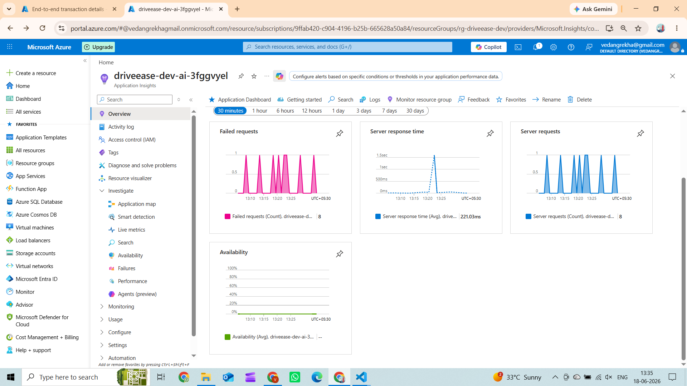
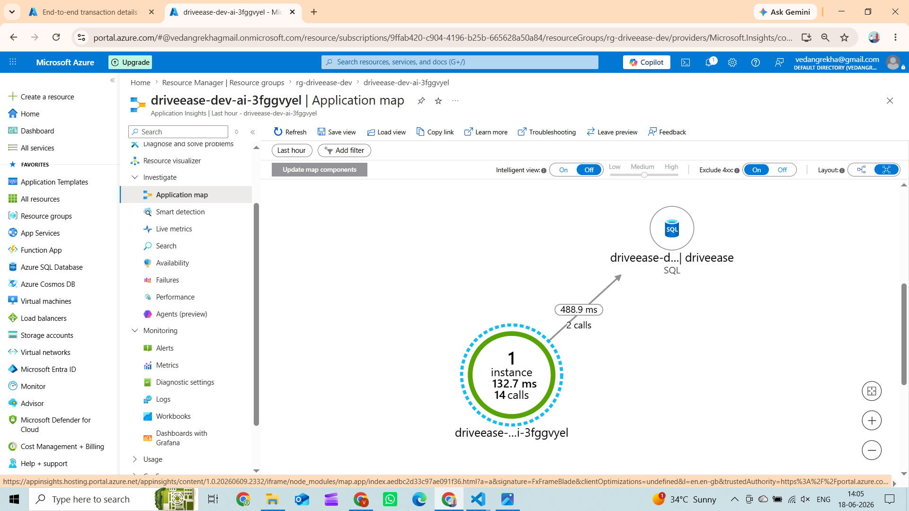
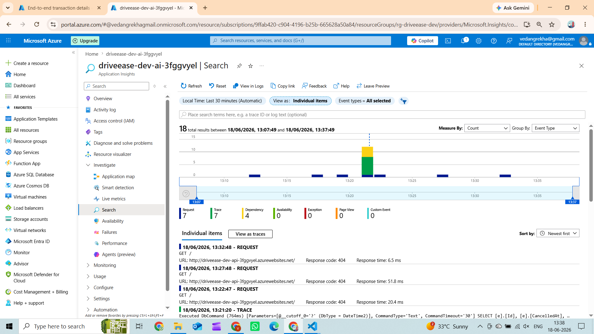
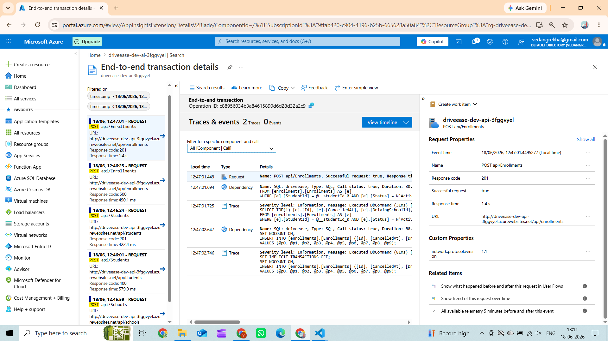
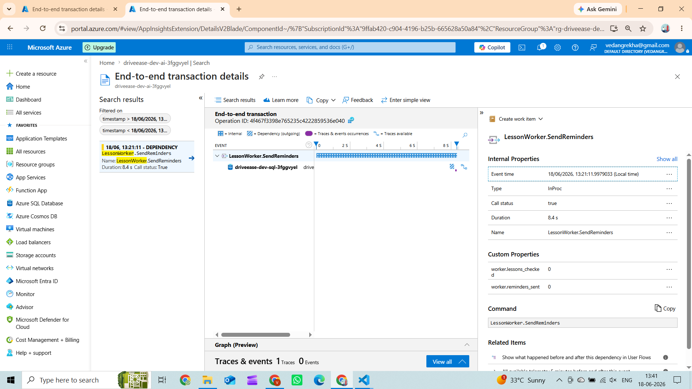
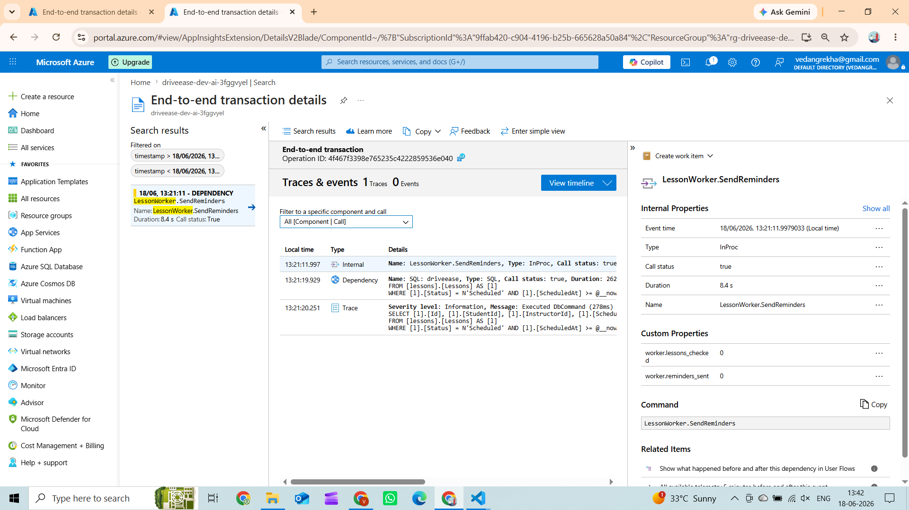
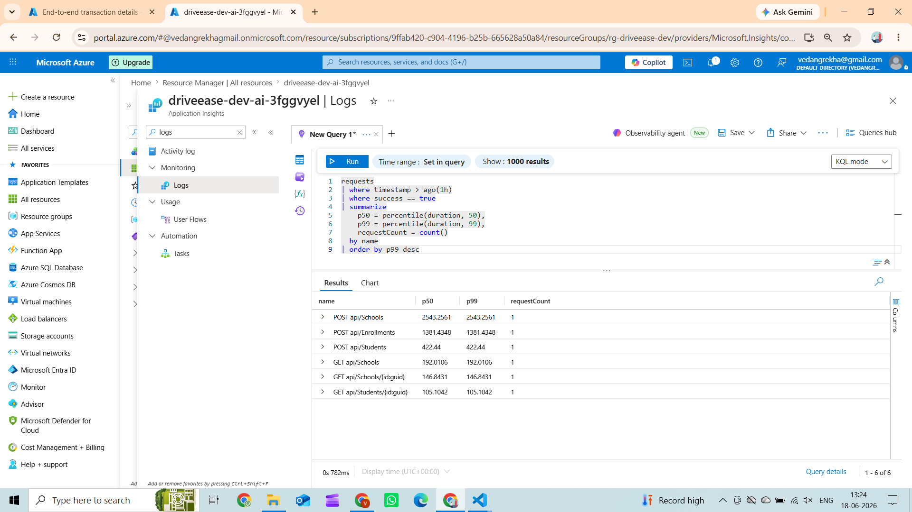

# Day 26 — App Insights + KQL: Making Production Legible

## What was built

OpenTelemetry wired end-to-end from the API through the background workers to the database, exporting every trace, metric, and structured log to Azure Application Insights via the `Azure.Monitor.OpenTelemetry.AspNetCore` distro.



> App Insights receives live telemetry from the deployed DriveEase API — showing failed requests, server response time, and request count in real time. The workspace-based App Insights resource is provisioned via Bicep and wired to the App Service through `APPLICATIONINSIGHTS_CONNECTION_STRING`.

---

## Architecture

```
HTTP Request
     │
     ▼
┌────────────────────────────────────────────────────────┐
│  ASP.NET Core (AddAspNetCoreInstrumentation)           │
│  → auto-span: POST /api/enrollments                    │
│       │                                                │
│       ├── MediatR handler (in-process)                 │
│       │       │                                        │
│       │       └── EF Core → SQL Server                 │
│       │               (AddSqlClientInstrumentation)    │
│       │                                                │
│       └── IEventBus.PublishAsync                       │
│               │                                        │
│     ┌─────────┴─────────────────────────┐              │
│     │ InMemoryEventBus (local dev)      │              │
│     │  handlers run in same Activity    │              │
│     │  → trace context flows in-proc   │              │
│     └─────────────────────────────────-┘              │
│     ┌─────────────────────────────────┐                │
│     │ AzureServiceBusEventBus (prod)  │                │
│     │  W3C traceparent injected into  │                │
│     │  message.ApplicationProperties  │                │
│     └─────────────────────────────────┘                │
└────────────────────────────────────────────────────────┘
                                │
                     Azure App Insights
                    (workspace-based, KQL)

Background Workers (root spans, no parent HTTP request):
  LessonReminderWorker.SendReminders
      └── LessonWorker.SendReminder  [per lesson]
              └── ServiceBus.Send lesson-events  [producer span]

  EnrollmentWorker.ProcessStale
      └── EnrollmentWorker.CancelEnrollment  [per enrollment]
              └── ServiceBus.Send enrollment-events  [producer span]
```



> The Application Map auto-discovers all components by analysing distributed trace data — showing the API calling the SQL database with average latency and call count. No configuration is needed; `AddSqlClientInstrumentation()` provides the dependency data automatically.

### Signal flow

| Signal | Transport | App Insights table |
|---|---|---|
| HTTP request spans | OTLP → Azure Monitor | `requests` |
| Outbound HTTP (Azure SDK calls) | OTLP → Azure Monitor | `dependencies` |
| SQL queries | OTLP → Azure Monitor | `dependencies` |
| Service Bus publish | Custom Activity (Producer) | `dependencies` |
| Worker root spans | Custom Activity | `requests` |
| ILogger messages | OTel logging bridge | `traces` |
| Exceptions | `RecordException` on activity | `exceptions` |
| Custom counters (enrollments, reminders) | OTel Meter → Azure Monitor | `customMetrics` |



> App Insights Search shows every telemetry event — requests, dependencies, traces, exceptions — as individual items linked by the same Operation ID. Clicking any REQUEST row jumps directly to the End-to-end transaction waterfall for that operation.

---

## Distributed trace stitching: API → Worker → DB

### What actually stitches (and what doesn't)

| Path | Stitched? | Why |
|---|---|---|
| API → `InMemoryEventBus` → notification handler → DB | ✅ Yes | Same process, same thread — `Activity.Current` is inherited automatically |
| API → `AzureServiceBusEventBus` → message → consumer | ✅ Yes (with consumer code) | W3C `traceparent` injected into `message.ApplicationProperties` |
| `LessonReminderWorker` timer tick → DB | ❌ No — independent root trace | Timer fires independently of any API request |
| `IncompleteEnrollmentWorker` timer tick → DB | ❌ No — independent root trace | Timer fires independently of any API request |

The background workers (`LessonReminderWorker`, `IncompleteEnrollmentWorker`) are scheduled by a timer — they are **not triggered by API calls**. Each tick starts its own root trace. They appear as separate top-level operations in App Insights, which is correct: you'd query them with `requests | where name startswith "EnrollmentWorker"` rather than looking for them as children of an HTTP request.



> The End-to-end transaction for a POST /api/Enrollments call shows the HTTP request as the root span with SQL INSERT as a child dependency — all sharing the same Operation ID. `AddSqlClientInstrumentation()` captures the SQL command automatically with no manual code.



> `LessonWorker.SendReminders` is the root span of its own independent trace — it fires on a 1-hour timer, not triggered by any API call, so it always starts a fresh Operation ID. Custom tags `worker.lessons_checked` and `worker.reminders_sent` are recorded on the Activity using `SetTag()`.



> Expanding the SQL dependency inside the worker trace reveals the exact SELECT query executed — captured automatically by `AddSqlClientInstrumentation()` and stored in the `dependencies` table. The Traces & events panel also shows the structured log message emitted by `ILogger` during the same tick.

---

**In-process path (local dev / InMemoryEventBus):**

The `InMemoryEventBus` dispatches handlers synchronously within the same `Activity` context. `Activity.Current` is inherited by all downstream calls — no extra work needed. The trace waterfall in App Insights looks like:

```
POST /api/enrollments                              [0ms → 42ms]
  └─ EnrollStudent.Handle                         [1ms → 40ms]
       ├─ SQL: INSERT INTO Enrollments ...         [2ms → 8ms]
       └─ InMemoryEventBus.Publish                [20ms → 38ms]
            └─ FakeNotificationSender.Handle       [21ms → 37ms]
```

**Cross-process path (prod / AzureServiceBusEventBus):**

When publishing to Service Bus, `AzureServiceBusEventBus` injects the W3C `traceparent` header into `message.ApplicationProperties` via `TraceContextPropagator.Inject()`. The consumer (e.g. a separate worker or Azure Function) extracts it like this:

```csharp
// Consumer side — restore trace context from message
if (message.ApplicationProperties.TryGetValue("traceparent", out var traceparent))
{
    var parentContext = ActivityContext.Parse(traceparent.ToString()!, null);
    using var activity = DriveEaseTelemetry.Source.StartActivity(
        "ServiceBus.Receive enrollment-events",
        ActivityKind.Consumer,
        parentContext);
    // ... process message
}
```

This produces a linked span in App Insights so the end-to-end trace spans the publish → consume boundary.

---

## KQL Queries

### 1 — Request latency p50 / p99 by endpoint (last 1 h)

```kusto
requests
| where timestamp > ago(1h)
| where success == true
| summarize
    p50 = percentile(duration, 50),
    p99 = percentile(duration, 99),
    requestCount = count(),
    errorCount = countif(success == false)
  by name
| extend errorRatePct = round(todouble(errorCount) / todouble(requestCount) * 100, 2)
| order by p99 desc
```

**What it tells you:** which endpoints are slowest at the 99th percentile — the ones your worst-case users experience. Use `name` to filter to a specific route (e.g. `name == "POST /api/enrollments"`).



> Query 1 running live against App Insights shows p50 and p99 latency per endpoint — revealing which routes are slowest at the 99th percentile. The `percentile()` aggregation computes this in a single pass over the `requests` table with no pre-aggregation needed.

---

### 2 — p50 / p99 bucketed over time (5-minute bins)

```kusto
requests
| where timestamp > ago(3h)
| summarize
    p50 = percentile(duration, 50),
    p99 = percentile(duration, 99),
    rps  = count()
  by name, bin(timestamp, 5m)
| order by name asc, timestamp asc
```

**What it tells you:** latency trends over time. Spot regressions after deploys by correlating the `bin(timestamp, 5m)` axis with your deployment events.

---

### 3 — Dependency call breakdown (SQL + Service Bus + outbound HTTP)

```kusto
dependencies
| where timestamp > ago(1h)
| summarize
    totalCalls    = count(),
    failedCalls   = countif(success == false),
    avgDuration   = round(avg(duration), 2),
    p99           = round(percentile(duration, 99), 2)
  by type, target, name
| extend errorRatePct = round(todouble(failedCalls) / todouble(totalCalls) * 100, 2)
| order by totalCalls desc
```

**What it tells you:** which downstream calls are the most frequent (SQL vs Service Bus vs HTTP), which are slowest, and which are failing. The `type` column distinguishes `SQL`, `Azure Service Bus`, and `HTTP`.

---

### 4 — End-to-end trace for a single operation_Id

```kusto
union requests, dependencies, traces, exceptions
| where timestamp > ago(24h)
| where operation_Id == "<paste-trace-id-from-App-Insights>"
| project
    timestamp,
    itemType,
    name,
    duration,
    success,
    operation_ParentId,
    id,
    message
| order by timestamp asc
```

**What it tells you:** the full waterfall for one distributed trace — HTTP request + SQL calls + Service Bus sends + any logged messages + exceptions, all in chronological order. This is what you paste a `traceId` into to debug a slow or failed request.

---

### 5 — Alert rule: error rate > 5 % over 5 minutes

```kusto
requests
| where timestamp > ago(5m)
| summarize
    total  = count(),
    failed = countif(success == false)
| extend errorRatePct = todouble(failed) / todouble(total) * 100
| where errorRatePct > 5
```

**Deployment:** save this as an **Azure Monitor Alert Rule** with:
- **Signal type:** Log (Log Analytics query)
- **Evaluation frequency:** 1 minute
- **Aggregation granularity:** 5 minutes
- **Threshold:** Results count > 0 (the `where errorRatePct > 5` does the filtering)
- **Action group:** PagerDuty / Teams webhook / email

---

### 6 — Custom metric: enrollments created per hour

```kusto
customMetrics
| where timestamp > ago(24h)
| where name == "driveease.enrollments.created"
| summarize total = sum(value) by bin(timestamp, 1h)
| order by timestamp asc
```

**What it tells you:** business-level throughput — how many enrollments per hour, useful for capacity planning and detecting drop-offs (e.g. after a payment gateway failure).

---

### 7 — Worker health: auto-cancellation rate

```kusto
customMetrics
| where timestamp > ago(7d)
| where name == "driveease.enrollments.auto_cancelled"
| summarize cancelled = sum(value) by bin(timestamp, 1d)
| order by timestamp asc
```

**What it tells you:** how many enrollments the background worker is auto-cancelling daily. A spike indicates a payment gateway issue or a surge in abandoned enrollments.

---

## Infrastructure changes

### New resource: Application Insights (workspace-based)

```
infra/modules/appinsights.bicep
  Microsoft.OperationalInsights/workspaces  (Log Analytics)
  Microsoft.Insights/components             (App Insights, workspace-based)
```

The App Insights connection string is passed directly to the App Service as `APPLICATIONINSIGHTS_CONNECTION_STRING` — the standard env-var that `UseAzureMonitor()` reads automatically. No Key Vault reference needed (connection strings are not secrets; they contain only a public instrumentation key and an ingestion endpoint URL).

### Resource naming

| Resource | DEV name pattern | PROD name pattern |
|---|---|---|
| Log Analytics | `driveease-dev-law-{suffix}` | `driveease-prod-law-{suffix}` |
| App Insights | `driveease-dev-ai-{suffix}` | `driveease-prod-ai-{suffix}` |

---

## Code changes summary

| File | Change |
|---|---|
| `DriveEase.Api.csproj` | Added `Azure.Monitor.OpenTelemetry.AspNetCore` + `OpenTelemetry.Instrumentation.SqlClient` |
| `DriveEase.Shared/Telemetry/DriveEaseTelemetry.cs` | New: shared `ActivitySource` + `Meter` + custom counters |
| `Program.cs` | Wired `AddOpenTelemetry()` with ASP.NET Core, HttpClient, SqlClient, custom source; conditionally calls `UseAzureMonitor()` |
| `appsettings.json` | Added `ApplicationInsights:ConnectionString` placeholder |
| `AzureServiceBusEventBus.cs` | Producer span + W3C `traceparent` / `tracestate` injection into message properties |
| `IncompleteEnrollmentWorker.cs` | Root worker span + per-enrollment child span + `EnrollmentsAutoCancelled` counter |
| `LessonReminderWorker.cs` | Root worker span + per-reminder child span + `LessonRemindersSent` counter |
| `infra/modules/appinsights.bicep` | New: Log Analytics workspace + workspace-based App Insights |
| `infra/main.bicep` | Wires `appInsights` module; passes connection string to `api` module |
| `infra/modules/api.bicep` | Accepts `appInsightsConnectionString` param; sets `APPLICATIONINSIGHTS_CONNECTION_STRING` app setting |
