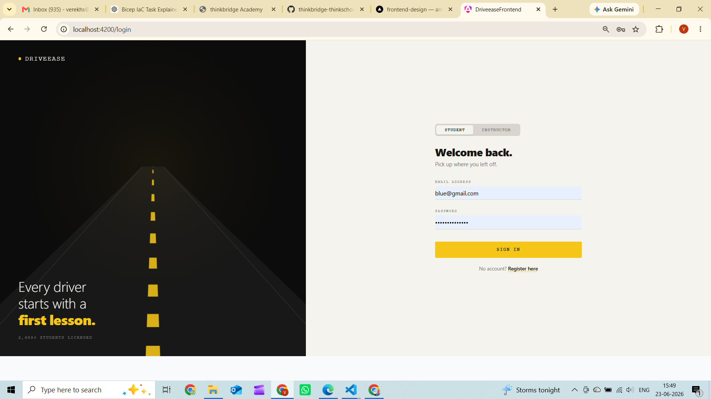
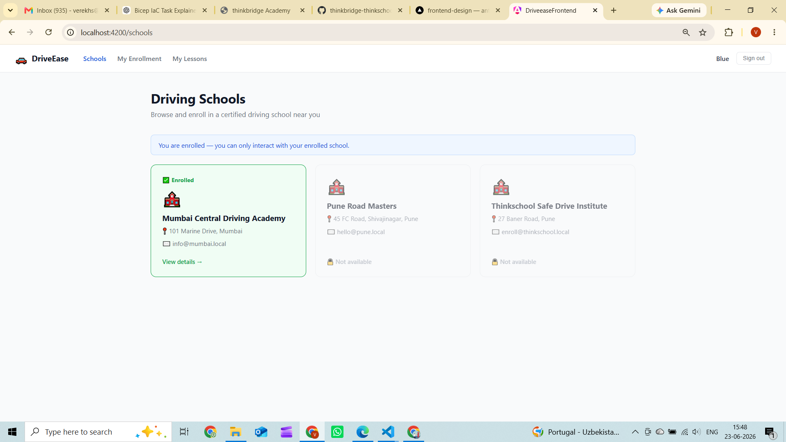
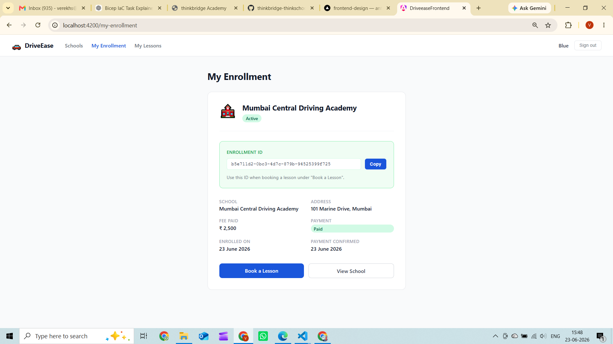
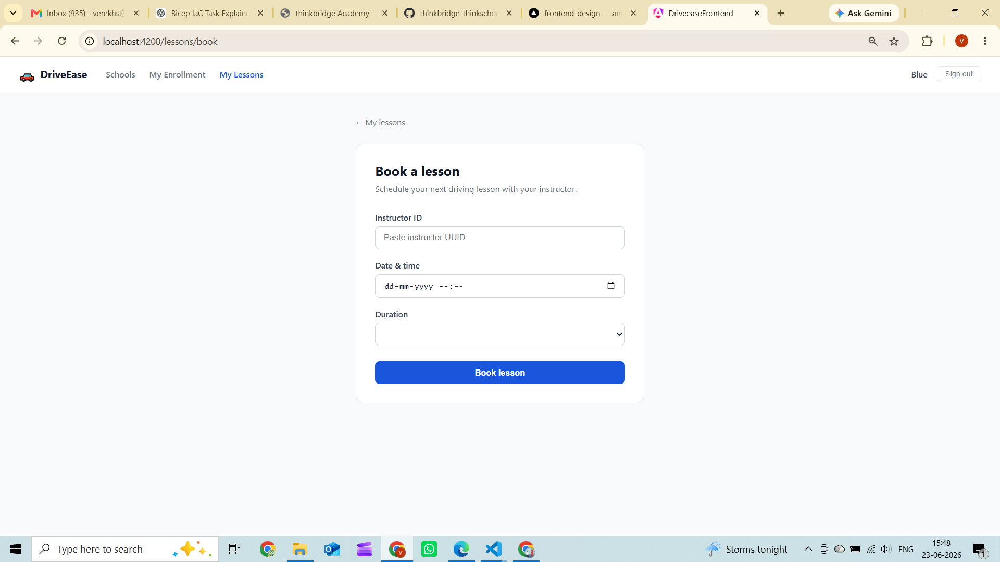

# Day 29 — Foundation + Happy Path End-to-End

=====================================================================

# Screenshots

=====================================================================

# Student Happy Path — curl walkthrough

----------------------------------------------------------------------

# 1. REGISTER

PS> Invoke-RestMethod -Method Post `
      -Uri "http://localhost:5000/api/v1/auth/register" `
      -ContentType "application/json" `
      -Body '{"fullName":"Vedang Shinde","email":"vedang@test.com","phoneNumber":null,"dateOfBirth":"2000-01-01","password":"Hesoyam#45"}'

id : 3f9c2b1a-...

----------------------------------------------------------------------

# 2. LOGIN → capture token

PS> $res   = Invoke-RestMethod -Method Post `
              -Uri "http://localhost:5000/api/v1/auth/login" `
              -ContentType "application/json" `
              -Body '{"email":"vedang@test.com","password":"Hesoyam#45"}'
PS> $token = $res.accessToken
PS> $res.fullName
Vedang Shinde

----------------------------------------------------------------------

# 3. LIST SCHOOLS

PS> Invoke-RestMethod -Uri "http://localhost:5000/api/v1/schools" `
      -Headers @{Authorization="Bearer $token"}

id            : 15d15651-e781-45e9-a980-d10738a93981
name          : Pune Road Masters
address       : 12 MG Road, Pune
contactEmail  : admin@puneroadmasters.com
isActive      : True

----------------------------------------------------------------------

# 4. ENROLL

PS> $enroll = Invoke-RestMethod -Method Post `
               -Uri "http://localhost:5000/api/v1/enrollments" `
               -ContentType "application/json" `
               -Headers @{Authorization="Bearer $token"} `
               -Body "{`"studentId`":`"$($res.studentId)`",`"drivingSchoolId`":`"15d15651-e781-45e9-a980-d10738a93981`",`"fee`":2500}"
PS> $enroll.id
a91f4c2e-05b3-4d7a-b832-1c9e8f3a2d77

----------------------------------------------------------------------

# 5. CONFIRM PAYMENT

PS> Invoke-RestMethod -Method Post `
      -Uri "http://localhost:5000/api/v1/enrollments/$($enroll.id)/payment" `
      -ContentType "application/json" `
      -Headers @{Authorization="Bearer $token"} `
      -Body "{}"

success : True

----------------------------------------------------------------------

# 6. GET MY ENROLLMENT

PS> Invoke-RestMethod -Uri "http://localhost:5000/api/v1/enrollments/me" `
      -Headers @{Authorization="Bearer $token"}

id                 : a91f4c2e-05b3-4d7a-b832-1c9e8f3a2d77
studentId          : 3f9c2b1a-...
drivingSchoolId    : 15d15651-e781-45e9-a980-d10738a93981
fee                : 2500
paymentStatus      : Paid
status             : Active
enrolledAt         : 2026-06-23T08:32:11Z
paymentConfirmedAt : 2026-06-23T08:32:14Z

----------------------------------------------------------------------

=====================================================================

# Instructor Happy Path — UI walkthrough

----------------------------------------------------------------------

# 1. OPEN LOGIN PAGE

Navigate to http://localhost:4200/login
See the Student / Instructor tab toggle at the top of the form.

----------------------------------------------------------------------

# 2. SWITCH TO INSTRUCTOR TAB

Click the "Instructor" tab.
Road animation turns green. Button changes to dark "Sign in as Instructor".

----------------------------------------------------------------------

# 3. REGISTER AS INSTRUCTOR

Click "Register as instructor" link.
Navigate to http://localhost:4200/instructor-register

Fill in:
  Full Name     : Rajesh Kumar
  Email         : rajesh@puneroadmasters.com
  License No.   : MH-1234567890
  School        : Pune Road Masters   (dropdown)
  Password      : Instructor#45

Click "Create Instructor Account"

----------------------------------------------------------------------

# 4. INSTRUCTOR DASHBOARD

Redirected to http://localhost:4200/instructor/dashboard

Topbar shows:
  DriveEase  [Instructor]  Pune Road Masters  |  rajesh  |  Sign out

Notifications (2 unread, green left border):
  🎓  Vedang Shinde  enrolled at Pune Road Masters     Today, 10:32 AM
  📅  Vedang Shinde  booked a lesson for tomorrow 9AM  Today, 11:05 AM

Upcoming Lesson card:
  Tomorrow · 9:00 AM  |  60 min
  Vedang Shinde
  First lesson — basic controls & road awareness
  [ Mark Complete ]  [ Give Feedback ]

----------------------------------------------------------------------

# 5. MARK NOTIFICATION READ

Click any notification card.
Green dot disappears. Green left border turns grey.
Unread badge in header decrements.

----------------------------------------------------------------------

=====================================================================
